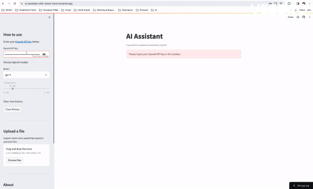

# AI Assistant

The Streamlit app for the AI Assistant can be found
[here](https://ai-assistant-with-vector-store.streamlit.app/).
You're welcome to give it a try!



## Overview

The AI Assistant is an intelligent conversational tool leveraging the power of
OpenAI's GPT models to provide insightful and interactive responses. Built with
Langchain for advanced agent management, memory handling, and tool creation,
the assistant offers a seamless user experience through a Streamlit-based interface.

Additionally, it incorporates FAISS for efficient document search capabilities,
allowing users to upload and search through PDF, DOCX, and TXT files. This
versatile assistant is designed to assist users with answering questions,
providing information, and retrieving relevant content from uploaded documents.

This tool is built on a combination of cutting-edge technologies:

- **[OpenAI](https://openai.com/)**: For conversational AI capabilities.
- **[Langchain](https://www.langchain.com/)**: For managing agents, memories,
and tools for the AI assistant.
- **[Streamlit](https://streamlit.io/)**: For the interactive user interface.
- **[FAISS](https://faiss.ai/)**: For creating a vector store to support
document search capabilities.

---

## Features

- Interactive chat interface with the AI Assistant.
- Choose between OpenAI's GPT-4 and GPT-3.5-turbo models.
- Upload and search through PDF, DOCX, and TXT documents.
- Clear chat history and update document storage.

---

## Installation Guide

Before installing the project, ensure you have the following installed:

- [Python](https://www.python.org/downloads/) (version 3.8 or higher)
- [pip](https://pip.pypa.io/en/stable/installation/) (Python package installer)

### macOS

```bash
# Install Python 3.x using Homebrew:
/bin/bash -c "$(curl -fsSL https://raw.githubusercontent.com/Homebrew/install/HEAD/install.sh)"
brew update
brew install python

# pip is already installed with Python 3.x on macOS.
```

### Linux (Ubuntu/Debian)

```bash
# Install Python 3.x:
sudo apt update
sudo apt install python3

# Install pip (Python Package Installer):
sudo apt update
sudo apt install python3-pip
```

### Windows

Install Python 3.x using Windows Installer:

- Download the latest Python 3.x installer from Python official website.
- Run the installer and select "Add Python to PATH" during installation.
- Click "Install Now" to install Python 3.x.
- The `pip` package is included by default with the Python installer for Windows.

---

## How to Run the Application

To run the application, follow the steps below:

1. Install Required Packages:

    ```bash
    # Install packages
    python -m pip install -r requirements.txt
    ```

    This command will install all the necessary dependencies listed in the
    requirements.txt file.

2. Run the Application:

    ```bash
       # Run application
       streamlit run main.py
    ```

    This command will start the application and execute the main.py script,
    allowing you to interact with the application.

---

## How to Use the AI Assistant

- **OpenAI API Key**:
  - Enter your OpenAI API key in the sidebar to access the assistant.
  Choose OpenAI model:

- **Select the desired model from the dropdown list**:
  - GPT-4 or GPT-3.5-turbo.

- **Temperature**:
  - Adjust the temperature slider for the assistant's response generation.

- **Clear Chat History**:
  - Click the "Clear History" button to clear the chat history.

- **Upload a File**:
  - Use the file uploader to support vector store capabilities based on
    uploaded files. Supported formats include PDF, DOCX, and TXT.

---

## About

This AI assistant is based on OpenAI and is designed to answer questions based
on its training knowledge. Additionally, it features a document upload
capability using a vector store.

Please note that this is a beta tool, and any feedback is appreciated to
enhance its performance.

## Author

- Sharon Mordechai.
